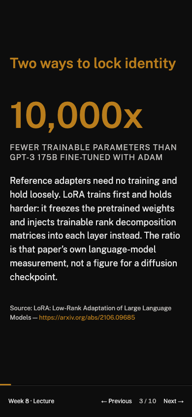

Assignment 1 earned stronger marks for the site than for explaining how I directed its agent. For Slop Opera, I made the task briefs part of the design: work on one collection at a time, report uncertainty, and keep course decisions in CLAUDE.md. My instruction was “Position before checks.” A good course would add one usable technique each week, assess what students had practised, and make feedback actionable. Those became explicit rules before their checks [5fc4e14](https://github.com/comp4020-agentic-coding-studio/comp4020-ass2-Ray0766/commit/5fc4e14734b4aa7da433196109bb1bddd32e4838).

I then replaced the first curriculum with an instrument ladder, so progress could be judged through recorded comparisons rather than twelve descriptions of tools. My brief specified “five rolls of one prompt” for week 2: selection was the skill, so more elaborate prompts would have changed the lesson. The agent rewrote lectures, then Dailies, then assessments, with checks between collections [e1284cb](https://github.com/comp4020-agentic-coding-studio/comp4020-ass2-Ray0766/commit/e1284cb8822fe68eb81405a0ed19e349cecbd13e), [76295d7](https://github.com/comp4020-agentic-coding-studio/comp4020-ass2-Ray0766/commit/76295d70a2ed264e676105f9b0e6c0079e6b4429), [a259c68](https://github.com/comp4020-agentic-coding-studio/comp4020-ass2-Ray0766/commit/a259c6885f9708c1a349b3bd969bde9571997cfb). The agent also corrected my brief. I had requested seven due rows; the agent reported nine due weeks and ten cells, including two assessments in week 12. I kept that correction. The new case also exposed a calendar that silently dropped the second assessment; restoring the old implementation made the check count nine instead of ten before the repair passed [6ed29ae](https://github.com/comp4020-agentic-coding-studio/comp4020-ass2-Ray0766/commit/6ed29ae22bc558e6bd07e23c7e4a370fd6fe1eb0).

The visual pass showed why a green report was insufficient. A browser review found builder instructions on student pages and a phone hero whose picture hid its title. I sent the findings back with a specific repair order: “Run it and confirm it is red for the right reason — it must name exactly the pages above.” The agent returned a failing check naming five pages, then replaced their copy [06aba39](https://github.com/comp4020-agentic-coding-studio/comp4020-ass2-Ray0766/commit/06aba39c3e910a66a40942031b681ed16b932348), [903cd24](https://github.com/comp4020-agentic-coding-studio/comp4020-ass2-Ray0766/commit/903cd24c75027f4b4274bba206ed3cecf0ac69ea). For the hero, I specified “Phone (≤ 640 px): no runway.” The repair gave it a separate composition, checked at rest and with reduced motion, and carried that decision into the next session through CLAUDE.md [c0ce3a4](https://github.com/comp4020-agentic-coding-studio/comp4020-ass2-Ray0766/commit/c0ce3a45c5c125107122a053f962d8568d765d51), [a408906](https://github.com/comp4020-agentic-coding-studio/comp4020-ass2-Ray0766/commit/a4089062af1059d1023c883918f37223b7b17010).

*Historical comparison saved at [1af0ecd](https://github.com/comp4020-agentic-coding-studio/comp4020-ass2-Ray0766/commit/1af0ecd87d5f8d5f25d0401efcc438aeacb924ab): the image's “current main” label means the revision captured then, not today's site.*

I also had to reopen an answer I had accepted. The agent called tiny phone slides a platform limitation, and my early account repeated it [1af0ecd](https://github.com/comp4020-agentic-coding-studio/comp4020-ass2-Ray0766/commit/1af0ecd87d5f8d5f25d0401efcc438aeacb924ab). In the final usability pass I asked for improvements wherever the brief allowed them. The agent changed the deck's layout and navigation without editing the platform package. All twelve weeks first failed the new readability check; after the repair, phone body text measured 18 px instead of 8.53 px, with working next, previous and return links [2a40f0b](https://github.com/comp4020-agentic-coding-studio/comp4020-ass2-Ray0766/commit/2a40f0bc1aefd9027fa7aff14102e10c7aad2e22). Calling it a “structural limitation” had explained the result without making it acceptable for students.

*Live capture at [984fa8f](https://github.com/comp4020-agentic-coding-studio/comp4020-ass2-Ray0766/commit/984fa8fd29d167895fe6f0b373b02c83147b2486); the text and navigation are the rendered page.*

For the backlot, I kept lessons on ordinary pages so 3D would not create a second curriculum [c4162ba](https://github.com/comp4020-agentic-coding-studio/comp4020-ass2-Ray0766/commit/c4162baa2a19b45189b9c603aad30add0dc8973d). I used a second agent that had built none of it to challenge acceptance. Disabling week 12's door and sending every door to week 1 still left 1,864 checks green. The resulting fix pressed every door and compared the reached page with its manifest destination; both injected faults then failed [9c8cbc8](https://github.com/comp4020-agentic-coding-studio/comp4020-ass2-Ray0766/commit/9c8cbc865d269bcd59bb3d63d3b61a52c01175dc). The reviewer supplied counterexamples I could act on. I deliberately leave teaching quality and source meaning outside automated acceptance: matching labels cannot prove useful feedback, and a citation cannot prove its claim. The harness records what the agents must preserve; I remain responsible for deciding what is worth preserving.
