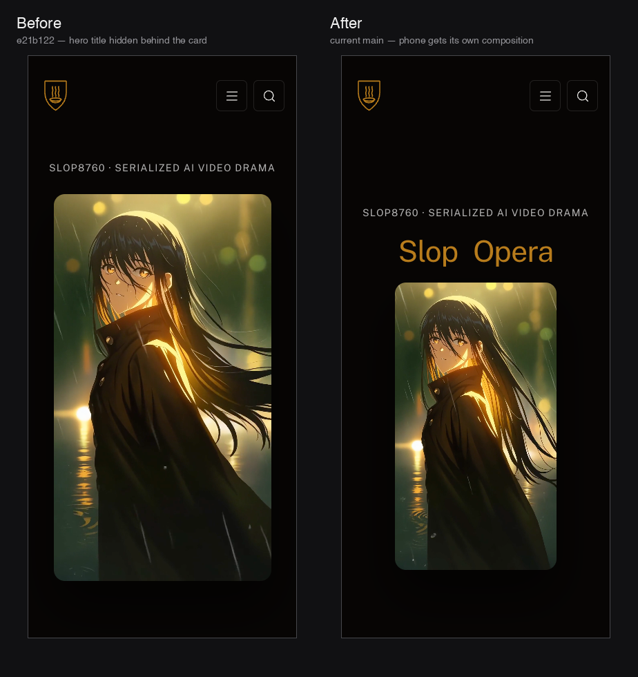

# Process overview

## What I built

SLOP8760, Slop Opera: a twelve-week studio course in serialized AI video drama for Slop University, built as the site a student would use — twelve dated lectures and Dailies, four assessments that add to 100, a Week 1 deck, policies, a release calendar and three small interactives — on the fixed Slop template. The idea under every page is that the machine shoots and only technique gets credit.

## How I got here

I started with an empty CLAUDE.md and Assignment 1 feedback that said the site was fine and the account of directing it was not. So the harness came first ([518f35d](https://github.com/comp4020-agentic-coding-studio/comp4020-ass2-Ray0766/commit/518f35d229a451a7bf275859561ca721ccdd0c03)), with one rule for the whole build: every line in it points at a failure that taught it. Dates, weights, the code and `spec/` are mine and the agent asks; spacing, palette and headings are its own, made and flagged in the report. Content went in one collection per session, each stopping for a report before the next.

The breakthrough came after the visual pass. It landed green, with the agent reporting done ([e21b122](https://github.com/comp4020-agentic-coding-studio/comp4020-ass2-Ray0766/commit/e21b1224609ae9766997161bb04981931f04d09b)). Reviewed outside the agent, in a real browser at both marking viewports and both themes, it had five faults no check could see: template copy written for me on pages a student reads; my own unlayered CSS restyling the theme's cards; a hero title never readable on a phone; a light theme nobody had looked at; a deck describing a different course from the site. The lesson was not the fixes. The agent's "done" and my checks measured the same thing, and neither was the page. I committed the broken pass as it was, so the trail shows the catch, then directed the repair sentinel-first:

> Write spec/builder-text.test.ts first … run it and confirm it is red for the right reason — it must name exactly the pages above. Commit the red sentinel on its own.

It named five pages before a word changed ([06aba39](https://github.com/comp4020-agentic-coding-studio/comp4020-ass2-Ray0766/commit/06aba39c3e910a66a40942031b681ed16b932348), [903cd24](https://github.com/comp4020-agentic-coding-studio/comp4020-ass2-Ray0766/commit/903cd24c75027f4b4274bba206ed3cecf0ac69ea)). Each fix carried its rule into CLAUDE.md in the same breath: the layer rule ([46e006b](https://github.com/comp4020-agentic-coding-studio/comp4020-ass2-Ray0766/commit/46e006b0bf016af265636e2a78c65bf8dcb55d0f), [7125d5d](https://github.com/comp4020-agentic-coding-studio/comp4020-ass2-Ray0766/commit/7125d5d035baa3e6684e5993f9c5b0d86ef73631)); the phone rule, with the hero rebuilt around it ([c0ce3a4](https://github.com/comp4020-agentic-coding-studio/comp4020-ass2-Ray0766/commit/c0ce3a45c5c125107122a053f962d8568d765d51), [a408906](https://github.com/comp4020-agentic-coding-studio/comp4020-ass2-Ray0766/commit/a4089062af1059d1023c883918f37223b7b17010)):

> The phone viewport is not a smaller desktop … the phone block is a third composition, not a variant of theirs.

Then the two-themes rule ([5d6bd5f](https://github.com/comp4020-agentic-coding-studio/comp4020-ass2-Ray0766/commit/5d6bd5f4ac0a1ea2aae2ef9b8351183028e2ebe4), [19ff24f](https://github.com/comp4020-agentic-coding-studio/comp4020-ass2-Ray0766/commit/19ff24f6920f222b236b01bb8ec016b9b2739f13)) and decks-are-content ([b373684](https://github.com/comp4020-agentic-coding-studio/comp4020-ass2-Ray0766/commit/b3736845ae4c20a3ab95ae4976bc58f19c9ded1d), [b220040](https://github.com/comp4020-agentic-coding-studio/comp4020-ass2-Ray0766/commit/b2200401f7bbbf3956524679acd72b8871662ec6)). Two limits I accepted rather than fought: astromotion's 1280×720 canvas letterboxes the deck on a phone, a platform layer every site in the cohort shares; and Lightning CSS folds `animation-timeline` into a shorthand Chrome rejects, so the hero is checked against `pnpm preview`'s minified output, never the dev server.

With the defects closed I went back to the marker's model — a prospective student with ten minutes — and asked what the content answered but the structure hid: the calendar. It became a release calendar derived from the collections, the break inferred from the data ([328308a](https://github.com/comp4020-agentic-coding-studio/comp4020-ass2-Ray0766/commit/328308ad433a06c07fdf60789a82b887037f4ddd)), guarded by a sentinel I watched go red by truncating the week selector ([5e83356](https://github.com/comp4020-agentic-coding-studio/comp4020-ass2-Ray0766/commit/5e8335651c54200a06d34b46f92d4d8199442915)), echoed on every week page ([f6f5785](https://github.com/comp4020-agentic-coding-studio/comp4020-ass2-Ray0766/commit/f6f578530fbb14adb993b0b265377d1eeb8b0767)) and on the assessment page as a weight bar ([fe2dd03](https://github.com/comp4020-agentic-coding-studio/comp4020-ass2-Ray0766/commit/fe2dd0355e3839d482c847c12e38869b9352eab2), [36ee6e3](https://github.com/comp4020-agentic-coding-studio/comp4020-ass2-Ray0766/commit/36ee6e33924369a73eb144963f86d7b37f4fc054)).

The last round added three interactives, one per lecture that teaches something a page can demonstrate, with their rules written into CLAUDE.md in the first widget's commit ([e59a842](https://github.com/comp4020-agentic-coding-studio/comp4020-ass2-Ray0766/commit/e59a84236207ca8f54b96e084794bfd17991940f), [b12b6dd](https://github.com/comp4020-agentic-coding-studio/comp4020-ass2-Ray0766/commit/b12b6dd33cee50d256cab33add17490d218c411f), [174ad87](https://github.com/comp4020-agentic-coding-studio/comp4020-ass2-Ray0766/commit/174ad875103124b473281233fb0a138ab076f683)): the static page carries the point with JS off, the script only adds the interaction. The agent extended scope once — the dark default into seven layouts instead of one — and flagged it in its report. That is the harness working, not failing.
